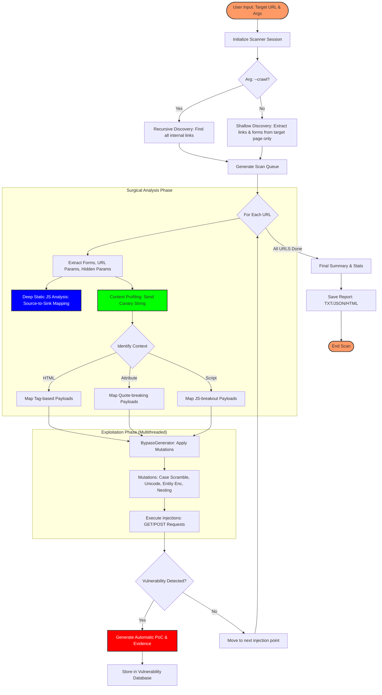

# Red Team XSS Suite v3.0 - Workflow Flowchart

## Deskripsi Alur Kerja (Professional Grade)

### 1. Discovery (Fase Pengintaian)
*   **Shallow Crawl (Default)**: Menganalisis endpoint tunggal untuk mengekstraksi semua form, parameter tersembunyi, dan link `<a>` yang ada pada halaman tersebut.
*   **Deep Crawl (`--crawl`)**: Penelusuran rekursif menyeluruh untuk memetakan seluruh arsitektur website target.

### 2. Surgical Analysis (Fase Pembedahan)
*   **Static JS Analysis**: Secara otomatis mendownload file JavaScript untuk melacak aliran data dari *Sources* user ke *Sinks* berbahaya (DOM XSS).
*   **Context Profiling**: Teknik pengiriman string "canary" untuk mengidentifikasi filter server dan konteks refleksi secara presisi (HTML, Atribut, atau Script).

### 3. Exploitation (Fase Penyerangan)
*   **BypassGenerator**: Inti dari fitur "Overpower" yang melakukan mutasi payload secara dinamis (Unicode, Entity Encoding, Case Scrambling).
*   **Recursive Nesting**: Teknik pembungkusan payload (seperti `<scr<script>ipt>`) untuk menembus filter pembersihan string yang tidak sempurna.

### 4. Validation & Reporting (Fase Pelaporan)
*   **Evidence Collection**: Menangkap potongan kode HTML yang membuktikan eksekusi script.
*   **PoC Generator**: Menghasilkan link exploit atau form simulasi yang siap digunakan dalam laporan audit profesional.
